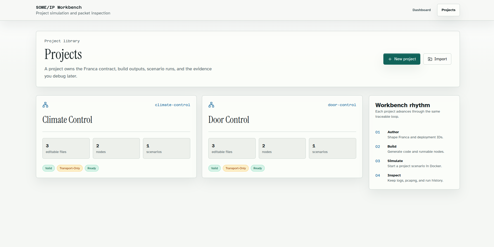

# SOME/IP Workspace

This workspace is a local SOME/IP and SOME/IP-SD simulation workbench. It combines COVESA vsomeip, CommonAPI runtimes, Franca source files, a typed FastAPI workflow API, and a React web service for project authoring, build, simulation, and capture inspection.

Editable projects live in `projects/`. Derived build output goes under `build/`, and per-run Docker Compose files, vsomeip configs, logs, and packet captures go under `runs/`.

## Preview



## Credits

The protocol runtime stack in this workspace is built on COVESA projects:

| Project | Role |
|---------|------|
| [COVESA vsomeip](https://github.com/COVESA/vsomeip) | SOME/IP and SOME/IP-SD runtime |
| [COVESA CommonAPI Core Runtime](https://github.com/COVESA/capicxx-core-runtime) | CommonAPI runtime abstractions |
| [COVESA CommonAPI SOME/IP Runtime](https://github.com/COVESA/capicxx-someip-runtime) | CommonAPI SOME/IP binding runtime |
| [COVESA CommonAPI Core Tools](https://github.com/COVESA/capicxx-core-tools) | Franca to CommonAPI generator tooling |
| [COVESA CommonAPI SOME/IP Tools](https://github.com/COVESA/capicxx-someip-tools) | SOME/IP deployment generator tooling |

Franca IDL is the interface source format used by the CommonAPI toolchain. This repository provides the workbench glue, project model, scripts, sample sources, and UI around that stack.

## Documentation

Start with [docs/index.md](docs/index.md) if you are creating or running projects. The detailed guides live in `docs/`; this README is only the repository overview.

| Guide | Purpose |
|-------|---------|
| [Getting started](docs/getting-started.md) | Setup, startup, and first DoorControl run |
| [Project creation](docs/project-creation.md) | Source-only versus runnable sample-backed projects |
| [Workbench workflow](docs/workbench-workflow.md) | What each UI route does |
| [Project model](docs/project-model.md) | `project.yaml`, Franca files, scenarios, generated output, and runs |
| [Authored vs generated](docs/generated-vs-authored.md) | Which files are source, generated, or runtime artifacts |
| [Troubleshooting](docs/troubleshooting.md) | Common validation, build, run, and capture problems |
| [Glossary](docs/glossary.md) | Terms used by the workbench |

## Quick Start

```bash
./scripts/01-setup.sh
./scripts/02-build-libs.sh
./scripts/03-download-generators.sh

cd services/web
pnpm install
cd ../..

./start-workbench.sh dev
```

Development startup runs FastAPI on `http://localhost:8000` and Vite on `http://localhost:5173`. The launcher requires `pnpm` and exits before starting either service when `pnpm` is not on `PATH`.

For a built web preview with API reload disabled:

```bash
./start-workbench.sh prod
```

The production preview runs the built web service on `http://localhost:4173`.

## Workbench Flow

The UI is project centered:

1. Open `/projects`.
2. Create or open a project.
3. Edit Franca `.fidl`, deployment `.fdepl`, or scenario YAML source.
4. Validate, generate, and build from the project workflow.
5. Start a saved scenario from Simulate.
6. Inspect node state, packet capture evidence, Wireshark action, logs, and rendered artifacts from the run inspection route.

DoorControl is the current runnable sample-backed project. Starter and Climate Control are source-only projects: they seed `.fidl`, `.fdepl`, `project.yaml`, nodes, and scenario YAML, then generation creates raw-vsomeip service/client nodes when full CommonAPI Core output is unavailable. See [Project creation](docs/project-creation.md) before adding a new project.

## Layout

```text
libs/                 COVESA vsomeip and CommonAPI runtime sources
examples/             C++ sample-backed projects, currently DoorControl
projects/             Manifest-backed editable workbench projects
services/api/         FastAPI workflow API
services/web/         React, Vite, Tailwind, Radix web service
scripts/              Setup, runtime build, generator download, and API contract scripts
configs/              Host-process CommonAPI and vsomeip configuration
docker/               Runtime and Wireshark container definitions
tools/generators/     Downloaded CommonAPI generator executables
build/                Generated build output
runs/                 Per-simulation artifacts and captures
docs/                 User and developer workflow documentation
```

## API Contract

FastAPI exposes API concerns only:

- `/api/v1`
- `/health`
- `/openapi.json`
- `/docs`

The committed OpenAPI schema is `services/api/openapi/v1.json`. Generated TypeScript schema types and RTK Query endpoints are stored under `services/web/src/generated/`.

```bash
./scripts/export-openapi.sh
./scripts/generate-web-api.sh
./scripts/check-web-api.sh
```

## Testing

Backend checks:

```bash
python3 -m compileall services/api/main.py services/api/routes/v1 services/api/schemas services/api/services
PYTHONPATH=services/api python3 -m unittest services/api/tests/test_workbench_services.py -v
```

Web checks:

```bash
cd services/web
pnpm run build
pnpm test
```

## Toolchain Limits

The bundled CommonAPI Core generator output does not include the base Core proxy and stub headers needed for full CommonAPI node implementations. Generation exposes this state as `transport-only`; SOME/IP transport output, generated raw-vsomeip service/client nodes, Docker runs, and packet capture collection can still work. If the Core and SOME/IP generator binaries are identical, the backend skips invalid Core `.fidl` generation and reports a toolchain warning.

Franca scenario `call`, subscription, event, and response assertions remain limited until generated scenario-driver sources implement those actions. The run inspection UI reports that limitation.

The existing manually written CommonAPI DoorControl proxy has a client lifecycle limitation: the service can run correctly while the client exits before a long interactive session. Full generator output or a runtime-side fix is needed for a complete generated client path.

## Requirements

- Linux with Docker and Docker Compose
- CMake 3.16 or newer
- GCC with C++20 support
- Boost development packages required by vsomeip
- Python 3.8 or newer
- Node.js 20 or newer and pnpm
- Java and Maven only when building CommonAPI generators from source

## License Notes

Original workbench code in this repository is licensed under the Apache License, Version 2.0. See `LICENSE` and `NOTICE`.

COVESA runtime source under `libs/` and CommonAPI-generated source files that carry Mozilla Public License 2.0 notices retain their upstream license terms. Downloaded generators, Franca tooling, Python packages, Node packages, container images, and other third-party dependencies retain their own license terms.
